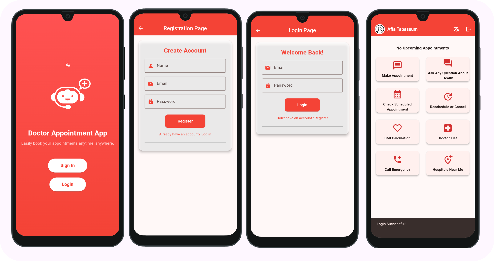
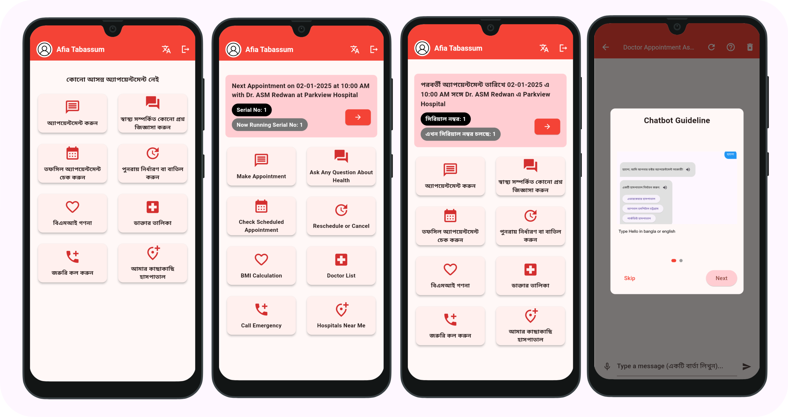
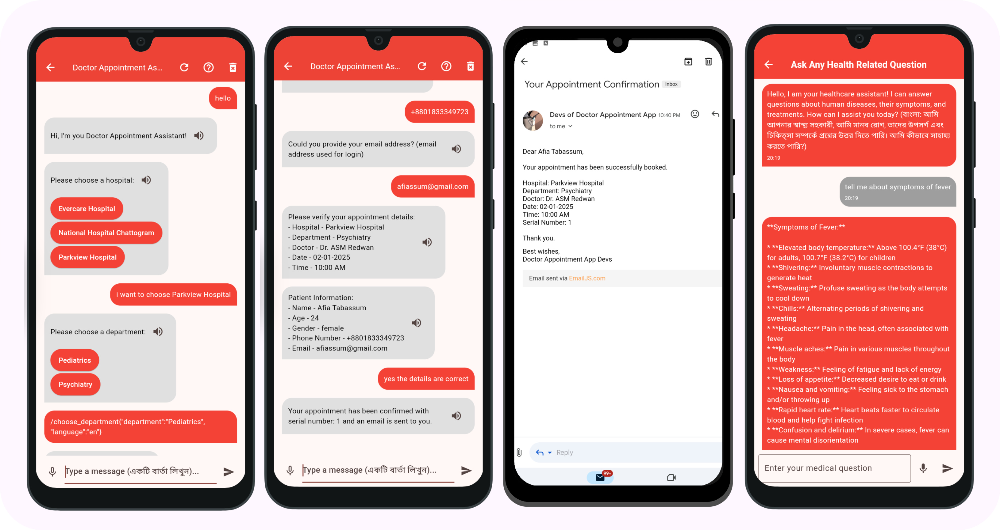
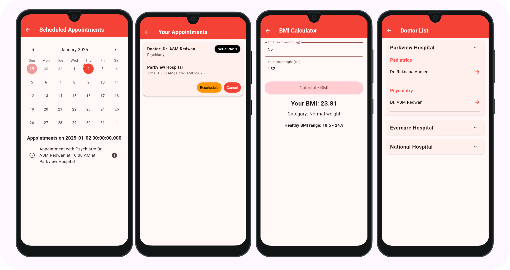
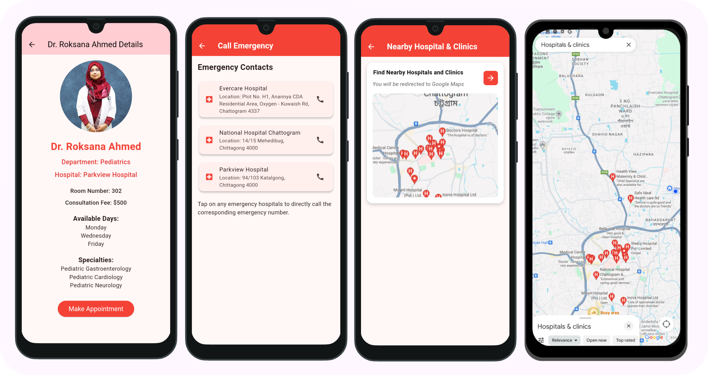
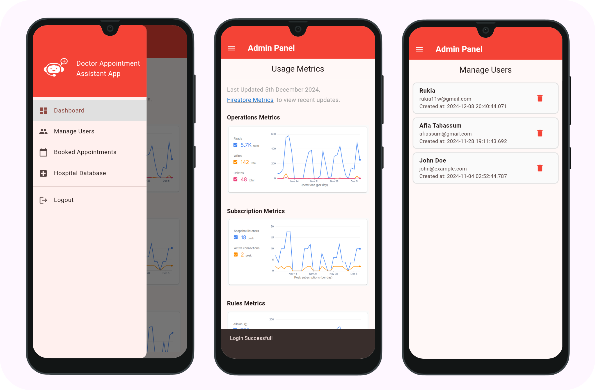
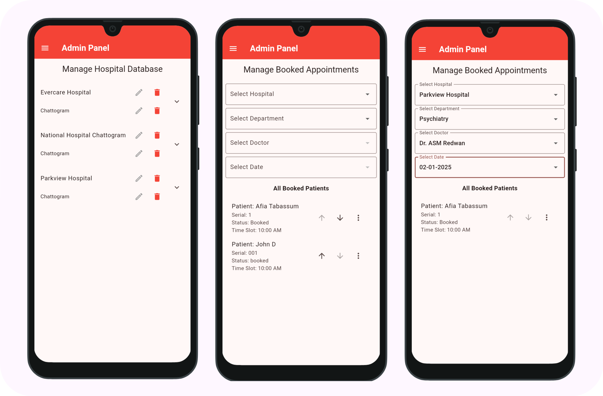

# Doctor Appointment System utilizing AI Chatbot with RASA Framework
<p align="center">

</p>
This project is a Doctor Appointment System (Mobile) app designed to help users book doctor appointments in the most efficient way. Rather than calling up centers, paying a visit or using complex appointment systems for the sake of making an appointment, users can just chat with an AI powered Chatbot with (NLP and ML) entity and intent recognition, to help users make appointments the most efficient way.

<br />
<br />

> [!NOTE]
> This app was developed in order to submit it as a final project for my final year at IIUC (International Islamic University Chittagong), hence this project requires a lot more work to be fully developed for deployment. It is made open-source for learning purposes, my team and I will soon make proper tutorials, documentation, and deploy proper code (as it is all messy due to lots of trials and errors) in a seperate repository. So, please star this repository if you would want to keep up with the updates! Any contributions are welcomed, please e-mail me beforehand, Thank you.

## License
Licensed under the Apache License 2.0. You are free to use, modify, and distribute this project in compliance with the terms of the license. See the [LICENSE](LICENSE) file for details.
<br />
<br />


# Overview
The app provides essential features like booking an appointment using an AI Chatbot (Appointment Making Assistant) powered with RASA Framework, viewing all made appointments, cancelling or rescheduling appointments and viewing details of all doctors available in a selected hospital and department. With integration to Cloud Firestore to handle real time data, it offers a smooth and convinient solution of having easy access to their preffered doctors according to doctor availibility time.


## Languages, tools, framework & Database
- Dart, Python, YML
- Android Studio/VS Code
- Flutter, RASA
- Cloud Firestore (NoSQL Real Time database) and Firebase Authentication (handles Authenticated App Users)
  
## Features
- **Splash Screen**: Displays an app logo during app startup.
- **Welcome Page**: Displays a welcome page for a signup and login buttons.
- **Sign Up Page**: Users can sign up with their Name, Email and Password.
- **Log In Page**: Users can log in with their Email and Password.

### User Panel
- **Home Page**: Displays a dashboard of user next most upcoming scheduled appointments if any, and 8 other buttons with each having the following features;
- **Make Appointment Page**: Allows users to communicate with a Chatbot (powered with RASA) to book an appoinmnet (it includes additional features of handling both Bangla and English Texts, STT and TTS).
- **Ask Any Health Related Questions Page**: Allows users to communicate with another Chatbot (powered by Gemini) to ask any health related questions.
- **Appointment List Page**: Allows users to reschedule or cancel any booked appointments (with a constraint that users can only reschedule/cancel 6 hrs before their due appointment time).
- **Calendar Page**: Provides a calendar that marks a star on the days when users have an appointment, upon navigating to that specific date, users can view their appointment details.
- **BMI Calculator Page**: Users can calculate their BMI if they wish.
- **View All Doctors Page**: Users can view doctor details in a selected hospital and department.
- **Call Emergency Page**: Users have access to emergency numbers of the selected hospitals.
- **Hospitals Nearby Page**: Users are navigated to Google Maps that shows all nearby clinics and hospitals near them, using their device location.

### Screenshots (WIP)








### Admin Panel
- **Drawer**: Provides easy navigation to the following pages;
- **Dashboard Page**: Allows admins to view Firestore Usage Metrics, since Firestore does not yet provide an API link to the usage metrics, a link to Cloud Firestore is provided to view them.
- **Manage Users Page**: Allows admins to view Authenticated App Users, and handle them as they wish.
- **Manage Appointment Page**: Allows admins to View All Appointments under a specific Doctor's Time Slot and manage them accordingly, they have the ability to reorder patients if urgent and can handle the Queueing System.
- **Manage Hospital Database Page**: Allows Admins to manage the Hospital Database, they can edit or delete as they wish. (Adding Functionality is yet to be implemented)

### Screenshots (WIP)





## Limitations
There are considerable amount of limitations that my team and I are currently fixing, failure to fix those features will be noted down here!

## Project Setup (WIP)
<!--
Follow the steps below to set up and run this project locally:

### Prerequisites

- [Flutter](https://flutter.dev/docs/get-started/install) (version 2.0 or higher)
- [Dart](https://dart.dev/get-dart)
- A suitable IDE (e.g., [VS Code](https://code.visualstudio.com/) or [Android Studio](https://developer.android.com/studio))

### Dependencies
*dependencies*
-  provider - A state management solution for managing and listening to app state changes.
-  pie_chart - A widget library for creating visually appealing pie charts.
-  intl - Provides internationalization and localization utilities, including date and number formatting.
-  shared_preferences - Stores simple key-value pairs locally on the device for persistent user settings.
-  hive - A lightweight and fast NoSQL database for local data storage.
-  hive_flutter - Hive integration with Flutter for seamless database usage.
-  device_preview - Enables testing and previewing the app on different devices and screen sizes.
-  fl_chart - A chart library for creating beautiful and customizable charts, such as line and bar graphs.


*dev_dependencies:*
-  hive_generator - Generates Hive type adapters for custom objects automatically.
-  build_runner -  A code generation tool used to generate files, such as Hive type adapters, at build time.

### Clone the Repository

```bash
git clone https://github.com/afia45/expense_tracker_app_local_db.git
cd expense_tracker_app_local_db
flutter pub get
flutter run
```

## 🔗 Screen Recordings

- [App Screen Recording](https://drive.google.com/file/d/11rtwWQE3fnGO07l7elz-ZVp94QnLo840/view?usp=sharing)

## 🔗 Presentation Slide
- [Presentation Slide](asset/Pouch_Planner.pdf)
-->
